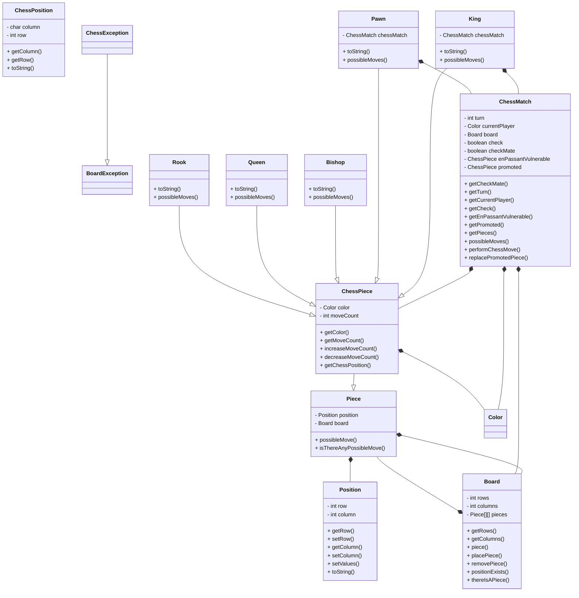

```mermaid
classDiagram
    class Position {
        - int row
        - int column
        + getRow()
        + setRow()
        + getColumn()
        + setColumn()
        + setValues()
        + toString()
    }
    class BoardException {
    }
    class Piece {
        - Position position
        - Board board
        + possibleMove()
        + isThereAnyPossibleMove()
    }
    Piece *-- Position
    Piece *-- Board
    class Board {
        - int rows
        - int columns
        - Piece[][] pieces
        + getRows()
        + getColumns()
        + piece()
        + placePiece()
        + removePiece()
        + positionExists()
        + thereIsAPiece()
    }
    Board *-- Piece
    class ChessMatch {
        - int turn
        - Color currentPlayer
        - Board board
        - boolean check
        - boolean checkMate
        - ChessPiece enPassantVulnerable
        - ChessPiece promoted
        + getCheckMate()
        + getTurn()
        + getCurrentPlayer()
        + getCheck()
        + getEnPassantVulnerable()
        + getPromoted()
        + getPieces()
        + possibleMoves()
        + performChessMove()
        + replacePromotedPiece()
    }
    ChessMatch *-- Color
    ChessMatch *-- Board
    ChessMatch *-- ChessPiece
    class ChessPiece {
        - Color color
        - int moveCount
        + getColor()
        + getMoveCount()
        + increaseMoveCount()
        + decreaseMoveCount()
        + getChessPosition()
    }
    ChessPiece --|> Piece
    ChessPiece *-- Color
    class ChessPosition {
        - char column
        - int row
        + getColumn()
        + getRow()
        + toString()
    }
    class Color {
    }
    class ChessException {
    }
    ChessException --|> BoardException
    class King {
        - ChessMatch chessMatch
        + toString()
        + possibleMoves()
    }
    King --|> ChessPiece
    King *-- ChessMatch
    class Pawn {
        - ChessMatch chessMatch
        + toString()
        + possibleMoves()
    }
    Pawn --|> ChessPiece
    Pawn *-- ChessMatch
    class Bishop {
        + toString()
        + possibleMoves()
    }
    Bishop --|> ChessPiece
    class Queen {
        + toString()
        + possibleMoves()
    }
    Queen --|> ChessPiece
    class Rook {
        + toString()
        + possibleMoves()
    }
    Rook --|> ChessPiece
```
Depois eu termino esse readme
